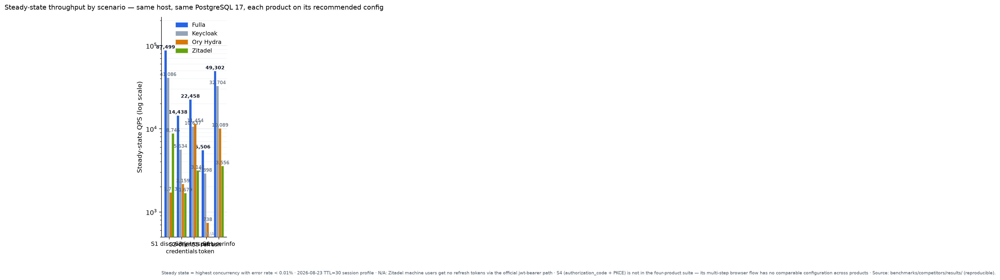

{/* Cover image slot — insert the five-scenario comparison bar chart here when produced.
     */}

Every identity server you can self-host today is a *process*: a JVM, a Go
binary, a Node app. None of them is a *library*. That gap is where Fulla
starts — and it is also why we ended up writing an OAuth2/OIDC server in
C++17 and benchmarking it, on identical hardware, against Keycloak, Ory
Hydra, and Zitadel.

This post covers three things: why the embeddable niche matters (§1), how we
made a four-product comparison as fair as we could — including two findings
that forced us to *withdraw* claims rather than publish them (§2), the
numbers with their explicit limits (§3), and what the benchmarking process
taught us beyond rankings (§4). Everything is reproducible from the repo.

## 1. Why C++ for identity infrastructure?

<!-- TODO ~300 words. Argument order: capability first, performance later.
- find_package(fulla-*) — the engine compiles INTO the host process; Keycloak/Ory/Zitadel are not libraries and cannot be
- 2.5 MB peak working set measured on a minimal host (examples/third-party-host, 184-line main) — edge/IoT/embedded territory
- auditable surface: no GC runtime, no JVM dependency tree — supply-chain footprint
- Material: examples/third-party-host/, docs/sdk/sdk-integration-guide.md -->

## 2. How to benchmark four identity servers fairly

<!-- TODO ~800 words. The hardest section — write it first.
Environment: one WSL2 host (8 vCPU / 16 GB), one PostgreSQL 17 instance, wrk 4.1.0 staircase 2→128 (5s warmup + 10s measure), each product on its OFFICIALLY recommended config, serial runs with `down -v` between products.
Versions: Keycloak 26.7.1 / Ory Hydra v26.2.0 / Zitadel v4.17.1 (chose v4 over v2 deliberately — two majors stale would misrepresent it).
Five scenarios: discovery / client_credentials / introspect / refresh_token / userinfo.

Honesty exhibit #1 — Keycloak S6 user-pool expiry: during the main session Keycloak's userinfo user pool aged past the realm's 1h accessTokenLifespan after the refresh-token staircase re-signed ~90k RTs → 100% 401s. We found it, fixed it (user pool re-minted before S6, baked into keycloak/run-all.sh), and re-ran that scenario in a targeted session. Disclose, don't hide.

Honesty exhibit #2 — GC jitter withdrawn: all four products (JVM and Go included) showed the same ~1.8s periodic spikes at the same time on the same machine → cross-product evidence of host noise, not runtime behavior. We therefore do NOT publish any tail-latency-smoothness claim, including ones favorable to us. Bare-metal re-measurement pending.

Reproducibility: benchmarks/competitors/run-comparison.sh + gen-comparison.py — the report contains no hand-entered numbers, everything traces to committed JSON.
Material: benchmarks/competitors/results/COMPARISON.md (appendix A has pool configs). -->

## 3. Results — with their limits

<!-- TODO ~600 words. Lead with the table, then the limits paragraph.
Core table (COMPARISON.md, 2026-08-23 TTL=30 profile):

| Scenario            | Fulla  | Keycloak | Ory Hydra | Zitadel | Fulla multiple (vs best) |
|---------------------|--------|----------|-----------|---------|--------------------------|
| S1 discovery        | 87,499 | 41,086   | 1,713     | 8,746   | 2.1×                     |
| S2 client_credentials| 14,438 | 5,634    | 2,159     | 1,679   | 2.6×                     |
| S3 introspect       | 22,458 | 10,637   | 11,454    | 3,142   | 2.0×                     |
| S5 refresh_token    | 5,506  | 2,898    | 738       | N/A     | 1.9×                     |
| S6 userinfo         | 49,302 | 32,704   | 10,089    | 3,556   | 1.5×                     |
| Cold start (fresh)  | 1.26s  | 18.3s    | 4.4s      | 5.3s    | ~3.5×                    |

Limits that MUST accompany every number:
- discovery is a stateless endpoint — 87k is NOT the token-issuance number; issuance is 14.4k
- WSL2 virtualization floor; driver CPU < 44% — figures are lower bounds
- memory, two explicit scopes: SDK-embedding 2.5 MB (third-party-host measured) vs full container ~2.35 GB (Postgres+Redis+Drogon pools; Ory is the lightest at 269 MB, we are the heaviest — said plainly)
- Zitadel S5 N/A: machine users have no refresh tokens via the official jwt-bearer path -->

## 4. What the benchmark taught us beyond rankings

<!-- TODO ~500 words. Pick 3-4, each a paragraph + pointer to the script comment:
1. docker initdb does NOT recurse into subdirs — "compose up auto-seeds" is a myth; seed must be applied via explicit psql -f (benchmarks/authforge/setup.sh retry loop handles the migration race)
2. refresh-token pools are one-shot — V008 family rotation + reuse detection means each RT is consumed once; S5 must re-mint the pool per concurrency level (--reseed) or you measure the reuse-detector, not the refresh path
3. shared rate-limit buckets — (ip, client_id) keying means one buggy run burns the failure budget for every VU → 429s for 60s; bench config now isolates this
4. session retention is TTL-bounded by design — not a leak; TTL 120→30 turned into S2 +13% / S6 +22% and cut full-stack RSS from 5.35 GB to 2.35 GB -->

## 5. What Fulla is, and what's next

<!-- TODO ~300 words.
One-paragraph status: AGPL-3.0 (Open Core), v1.1.0, Docker/Helm deployment, admin + user frontends, OAuth2/OIDC (PKCE mandatory, RFC 6749/6750/7636/7662/7009/8414/8628 + OIDC Core/Discovery/RP-Logout), Python & Go client SDKs, C++ SDK.
Three links, nothing more: GitHub https://github.com/voidvec/fulla · https://fulla.dev · pip install fulla-oauth2 (go get github.com/voidvec/fulla/clients/go)
Next: SAML/SCIM under customer-driven evaluation; bare-metal re-measurement for tail latency.
CTA: "Star it if useful." Stop there. -->

---

{/* FAQ appendix — keep or fold into §5? Decide at final draft.
   Prepared answers for the comment sections: vs-Keycloak-maturity, vs-Ory-cloud-native, why-AGPL. See docs-local/blog/2026-09-launch-post-skeleton.md. */}
